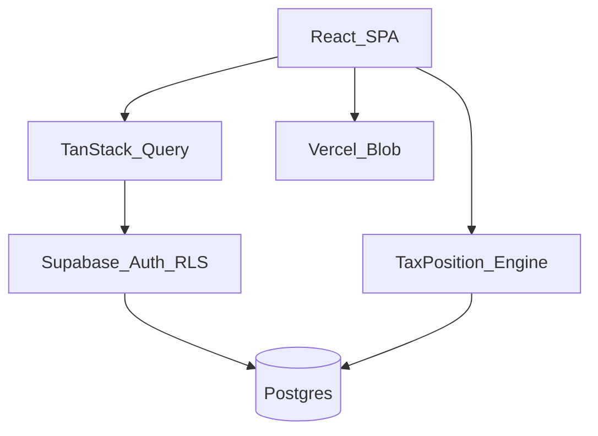

# AJX Tax MVP v1 — Implementation Architecture

**Status:** Canonical for MVP v1 implementation  
**Audience:** Engineering  
**Product scope:** [mvp-v1-scope.md](../product/mvp-v1-scope.md)  
**Decisions:** [ADR-023](./adr/023-mvp-v1-implementation-architecture.md) · [ADR-022](./adr/022-incremental-mvp.md)

Build only what MVP needs. Full-platform docs remain valid as the long-term north star; this document is the **active implementation contract**.

---

## 1. Goals

| Goal | Meaning for MVP |
|------|-----------------|
| **Mobile first** | Phone layout is the default; tablet/desktop enhance, not reverse-engineer |
| **Responsive** | One SPA, fluid breakpoints; touch targets ≥ 44px |
| **Professional** | Premium SaaS feel; calm chrome; no spreadsheet density |
| **Modern** | React 19, typed end-to-end, semantic design tokens (light + dark) |
| **Fast** | Keyset pagination, FY-scoped queries, snapshots for dashboard/summary — never load full history into the client |

---

## 2. Technology stack (locked)

| Layer | Choice | Role |
|-------|--------|------|
| UI | **React** + **TypeScript** | Application |
| Build | **Vite** | Dev server + SPA bundle |
| Styling | **Tailwind** | Utility CSS + design tokens |
| Components | **shadcn/ui** | Accessible primitives (compose, don’t fork) |
| Backend | **Supabase** | Auth, Postgres + RLS, storage metadata, optional Realtime |
| Hosting | **Vercel** | Static SPA + Blob for evidence binaries + Cron later |
| Data fetching | TanStack Query | Server state cache |
| Forms | React Hook Form + Zod | Validation |
| Routing | React Router | Client routes |

**Not in MVP stack:** Next.js, Redux/Zustand as default store, Prisma, Electron/Capacitor, local-only persistence for Tax Position or Evidence.

---

## 3. High-level system

```text
Browser (Vite SPA)
  ├── React Router + App shell (mobile / tablet / desktop)
  ├── TanStack Query
  └── Supabase JS (Auth + PostgREST + RLS)
         │
         ├── Postgres (Tax Position, Evidence metadata, imports, exports)
         └── Vercel Blob (evidence file bytes)
```



- **SPA never holds the service role key.**  
- **Tax maths** run in a pure TS engine (`tax-position` / shared domain); results persist as `tax_year_summaries`.  
- **Important data lives in Supabase** (or Blob). UI draft state is ephemeral only.

---

## 4. Repository layout

```text
src/
├── app/                         # Shell only: providers, router, layouts
│   ├── providers/
│   ├── layouts/
│   └── pages/                   # Rare: design-system, marketing stubs
├── features/                    # Business capabilities (see §5)
├── shared/
│   ├── components/              # ui (shadcn) + ajx product primitives
│   ├── hooks/
│   ├── lib/                     # supabase client, cn, format, fy, errors
│   ├── integrations/            # Extension interfaces (stubs in MVP)
│   └── types/
├── styles/                      # tokens.css (light + dark)
└── main.tsx

supabase/migrations/             # Schema + RLS
docs/product/mvp-v1-scope.md
docs/architecture/17-mvp-v1-implementation.md   # this file
```

### Rules

1. Features import **only** from `features/<name>/index.ts` public API.  
2. Shared code has **no** feature business rules.  
3. Files stay small (~300 lines). Split early; no “god” pages.  
4. No duplicated FX, bracket, or formatting logic — use engine + `shared/lib`.  
5. No temporary hacks that bypass RLS or type safety.

---

## 5. Feature modules (MVP)

Each feature folder:

```text
src/features/<name>/
├── components/
├── hooks/
├── services/          # Supabase / Blob / engine adapters
├── types/
├── utils/
├── pages/             # Route screens (optional but preferred)
└── index.ts           # Public exports only
```

| Feature | Owns | Does not own |
|---------|------|--------------|
| **auth** | Login, session, route guards | Profile tax settings |
| **dashboard** | FY home insights composition | Raw ledger CRUD |
| **tax-position** | FY container, year settings, summary orchestration, **parity engine** | File binaries |
| **income** | Employment, foreign, investments UI + services | Bracket tax maths (calls engine) |
| **expenses** | Deductions, travel, apartment, transport, car km UI + services | Binary storage |
| **evidence** | Upload, categorise, FY filter, link to claims | AI extraction |
| **imports** | AJX Tax JSON backup wizard + adapters | Ongoing sync |
| **exports** | Accountant summary PDF, JSON backup, ZIP package jobs | Collaborator portal |
| **settings** | Theme, account, FY prefs, migration admin | Tax ledgers |

`tax-position` is the **calculation authority**. `income` and `expenses` are focused UI/service slices over the same domain tables — they call into `tax-position` services/engine, they do not maintain a second calculator.

---

## 6. Data & persistence

### Source of truth

| Data | Store |
|------|--------|
| Identity / session | Supabase Auth |
| Tax Position ledgers + summaries | Postgres (RLS by `user_id`) |
| Evidence metadata | Postgres |
| Evidence bytes | Vercel Blob (path referenced from Postgres) |
| Import batches / legacy id map | Postgres |
| Export job status + artefact refs | Postgres |

**Avoid:** `localStorage` / IndexedDB as the system of record for Position, Evidence, imports, or exports. Local cache is allowed only as TanStack Query cache or explicit draft autosave that reconciles to Supabase.

### FY scoping

- Every list and mutation is scoped by **financial year** (`fy_end_year` / `financial_years` row).  
- Dashboard and summary read **materialised summary** rows, not N+1 over all claim lines.

### Tax engine

- Pure functions under `features/tax-position` (or extractable `shared` domain later).  
- Pinned `engine_version` (e.g. `calculator-parity-2026.1`).  
- Parity fixtures gate changes ([tax-calculation-parity](../testing/tax-calculation-parity.md)).

---

## 7. UI architecture

- **Mobile first:** bottom nav on phone; sidebar from `md+`.  
- **Shells:** one `AppShell`; content regions use skeletons (U1) and empty states (U2).  
- **Primitives:** compose `shared/components` (`Skeleton`, `EmptyState`, `ConfirmDialog`, `UploadStatus`, `ErrorBanner`, `DraftStatus`, `JobProgress`, `UndoToast`) — do not reimplement per feature.  
- **Tokens only** for colour; light + dark from day one.  
- **Pages stay thin:** page → feature hooks → services; presentational components under `components/`.

---

## 8. Extension interfaces (stubs only in MVP)

Implement **interfaces + no-op adapters**. Do not build product UI that depends on them.

```text
src/shared/integrations/
├── ingest-provider.ts      # AI processing later
├── drive-sync.ts           # Google Drive later
├── accountant-access.ts    # Accountant portal later
├── audit-mode.ts           # Advanced audit later
└── job-runner.ts           # Sync runner now; Edge/Cron later
```

| Future feature | Interface responsibility | MVP behaviour |
|----------------|--------------------------|---------------|
| **AI processing** | `IngestProviderAdapter.processDocument` | No-op / mark upload `ready` |
| **Google Drive** | `DriveSyncAdapter` connect/sync | `disconnected` |
| **Accountant access** | Invite/grant port (unused) | Exports only via `exports` feature |
| **Audit Mode** | Package/audit port (unused) | Not exposed in nav |

Registration: single `register*` function per adapter so a later package can swap implementations without touching feature screens.

---

## 9. Routing (MVP)

| Path | Feature |
|------|---------|
| `/auth` | auth |
| `/` | dashboard |
| `/position` | tax-position (hub) |
| `/position/summary` | tax-position |
| `/income` | income |
| `/expenses` | expenses |
| `/evidence` | evidence |
| `/import` | imports |
| `/export` | exports |
| `/settings` | settings |

Authenticated routes wrap `RequireAuth` + `AppShell`.

---

## 10. Quality constraints

- Strict TypeScript; no `any` for domain money/FX.  
- Shared error catalogue (`shared/lib/errors`) — user-facing copy only (U6).  
- Destructive actions confirmed (U3); uploads retryable (U5); long jobs show progress (U4).  
- Calculations traceable (U11–U12) via summary provenance UI.  
- Performance: keyset pagination on evidence/claims; virtualize only if lists grow large.

---

## 11. Explicit non-goals (this architecture)

- Building AI OCR, Drive mirror, accountant portal, or audit studio.  
- Monorepo / native apps (folder shapes stay extractable later).  
- Org multi-tenancy (keep `user_id` RLS; nullable `organization_id` only if already in schema — do not build org UI).  
- Premature microservices or event buses.

---

## 12. Related documents

| Doc | Role |
|-----|------|
| [mvp-v1-scope.md](../product/mvp-v1-scope.md) | What the product does |
| [01-mvp-v1.md](../product/01-mvp-v1.md) | Build phases & standards exceptions |
| [ADR-023](./adr/023-mvp-v1-implementation-architecture.md) | Decision record for this architecture |
| [03-feature-first-structure.md](./03-feature-first-structure.md) | Long-term feature-first principles |
| [01-technology-stack.md](./01-technology-stack.md) | Full ADR index + locked stack |
| [06-implementation-roadmap.md](./06-implementation-roadmap.md) | Active order = MVP, then Phases 0–4 |
